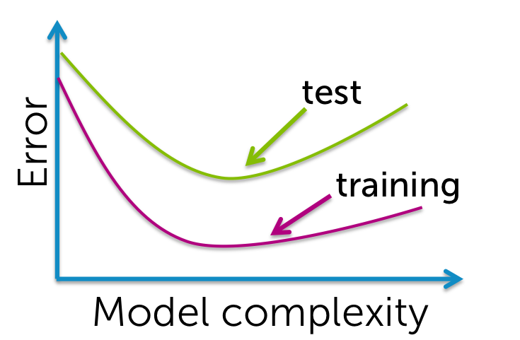

1. Qual figura representa um modelo com ajuste excessivo?

1. Verdadeiro ou falso: O modelo que melhor minimiza o erro de treinamento é aquele que terá o melhor desempenho para a tarefa de previsão em novos dados.

`falso`
1. A tabela a seguir ilustra os resultados da avaliação de 4 modelos com diferentes opções de parâmetros em um conjunto de dados.  Qual dos seguintes modelos se ajusta melhor a esses dados?

`Modelo 3 [menor RSS]`

1. Suponha que ajustamos a seguinte função quadrática: f(x) = w0+w1*x+w2*(x^2) ao conjunto de dados mostrado (círculos azuis).  A função ajustada é mostrada pela curva verde na figura abaixo.  Dos 3 parâmetros da função ajustada (w0, w1, w2), quais são estimados como 0? ( Observação: o senhor deve selecionar todos os parâmetros estimados como 0 para acertar a pergunta)
- [ ] w0
- [ ] w1
- [x] w2
- [ ] nenhuma das opções acima

1. Suponha que ajustamos a seguinte função quadrática: f(x) = w0+w1*x+w2*(x^2) ao conjunto de dados mostrado (círculos azuis). A função ajustada é mostrada pela curva verde na figura abaixo.  Dos 3 parâmetros da função ajustada (w0, w1, w2), quais são estimados como 0? ( Observação: o senhor deve selecionar todos os parâmetros estimados como 0 para acertar a pergunta)

- [x] w0
- [ ] w1
- [x] w2
- [ ] nenhuma das opções acima

1. Suponha que ajustamos a seguinte função quadrática: f(x) = w0+w1*x+w2*(x^2) ao conjunto de dados mostrado (círculos azuis). A função ajustada é mostrada pela curva verde na figura abaixo.  Dos 3 parâmetros da função ajustada (w0, w1, w2), quais são estimados como 0? ( Observação: o senhor deve selecionar todos os parâmetros estimados como 0 para acertar a pergunta)

- [ ] w0
- [ ] w1
- [ ] w2
- [x] nenhuma das opções acima

1. Suponha que ajustamos a seguinte função quadrática: f(x) = w0+w1*x+w2*(x^2) ao conjunto de dados mostrado (círculos azuis). A função ajustada é mostrada pela curva verde na figura abaixo.  Dos 3 parâmetros da função ajustada (w0, w1, w2), quais são estimados como 0? ( Observação: o senhor deve selecionar todos os parâmetros estimados como 0 para acertar a pergunta)

- [x] w0
- [ ] w1
- [ ] w2
- [ ] nenhuma das opções acima

1. Qual dos gráficos a seguir o senhor não esperaria ver como um gráfico das curvas de erro de treinamento e teste?

1. Verdadeiro ou falso: É sempre preferível usar um modelo com mais recursos, pois ele captura melhor o verdadeiro processo subjacente.

`falso`
