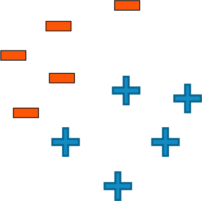

1.  O classificador de limiar simples para análise de sentimentos descrito no vídeo(marque todas as opções aplicáveis):

- [x] Deve ter atributos positivos e negativos predefinidos
- [x] Deve contar os atributos igualmente ou pré-definir pesos nos atributos
- [ ] Define um limite de decisão possivelmente não linear

1. Para um classificador linear que classifica entre sentimento "positivo" e "negativo" em uma avaliação x, Score(x) = 0 implica(marque todas as opções aplicáveis):

- [x] A avaliação é claramente "negativa"
- [x] Não temos certeza se a avaliação é "positiva" ou "negativa"
- [ ] Precisamos treinar novamente nosso classificador porque ocorreu um erro

1. Para qual dos seguintes conjuntos de dados um classificador linear teria um desempenho perfeito?

1. Verdadeiro ou falso: A alta precisão de classificação sempre indica um bom classificador.

`falso`

1. Verdadeiro ou falso: Para um classificador que classifica entre 5 classes, sempre existe um classificador com precisão maior que 0,18.

`Verdadeiro`

1. Verdadeiro ou falso: Um falso negativo é sempre pior do que um falso positivo.

`Falso`

1. Quais das seguintes afirmações são verdadeiras?(Marque todas as opções aplicáveis)

- [x] O erro de teste tende a diminuir com mais dados de treinamento até um ponto e, em seguida, não se altera (ou seja, a curva se achata)
- [ ] O erro de teste sempre chega a 0 com um conjunto de dados de treinamento ilimitadamente grande
- [ ] O erro de teste nunca é uma função da quantidade de dados de treinamento