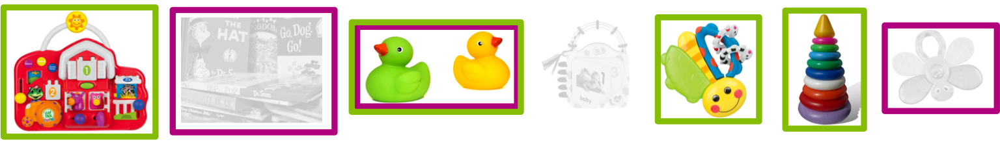
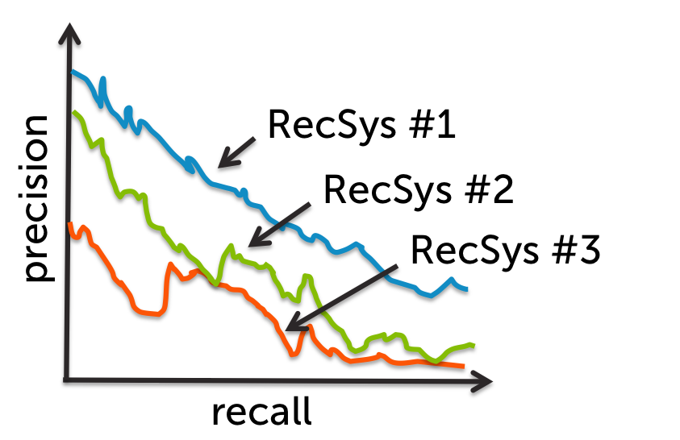

1. A recomendação de itens com base na popularidade global pode(marque todas as opções aplicáveis):

[ ] fornecer personalização
[ ] capturar o contexto (por exemplo, hora do dia)
[x] nenhuma das opções acima

1. A recomendação de itens usando uma abordagem de classificação pode(marque todas as opções aplicáveis):

[x] fornecer personalização
[x] capturar o contexto (por exemplo, hora do dia)
[ ] nenhuma das opções acima

1. A recomendação de itens usando uma matriz de co-ocorrência simples baseada em contagem pode(marque todas as opções aplicáveis):

[x] fornecer personalização
[ ] capturar o contexto (por exemplo, hora do dia)
[ ] nenhuma das opções acima

1. A recomendação de itens usando a fatoração de matriz caracterizada pode(marque todas as opções aplicáveis):

[x] fornecer personalização
[x] capturar o contexto (por exemplo, hora do dia)
[ ] nenhuma das opções acima

1. A normalização das matrizes de co-ocorrência é usada principalmente para levar em conta:

`itens comprados por muitas pessoas`

1. Uma loja tem 3 clientes e 3 produtos.  Abaixo estão os vetores de recursos aprendidos para cada usuário e produto. Com base nesse modelo estimado, qual produto o senhor recomendaria mais ao usuário nº 2?

|ID do usuário|Vetor de características|
|-|-|
|1|(1.73, 0.01, 5.22)|
|2|(0.03, 4.41, 2.05)|
|3|(1.13, 0.89, 3.76)|

|ID do usuário|Vetor de características|
|-|-|
|1|(3.29, 3.44, 3.67)|
|2|(0.82, 9.71, 3.88)|
|3|(8.34, 1.72, 0.02)|

`Produto nº 2`

1. Para os itens preferidos e recomendados exibidos abaixo, calcule o recall e arredonde para 2 casas decimais. (Como na lição, os quadrados verdes indicam itens recomendados e os quadrados magenta são itens apreciados.  Os itens não recomendados estão em cinza para maior clareza) Observação: digite sua resposta no formato decimal americano (por exemplo, digite 0,98, não 0,98)

`0.33`

1. Para os itens curtidos e recomendados exibidos abaixo, calcule a precisão e arredonde para 2 casas decimais.(Como na lição, os quadrados verdes indicam itens recomendados e os quadrados magenta são itens apreciados. Os itens não recomendados estão em cinza para maior clareza) Observação: digite sua resposta no formato decimal americano (por exemplo, digite 0,98, não 0,98)

`0.25`

1. Com base nas curvas de precisão-recall da figura abaixo, qual recomendador o senhor usaria?

`RecSys #1`