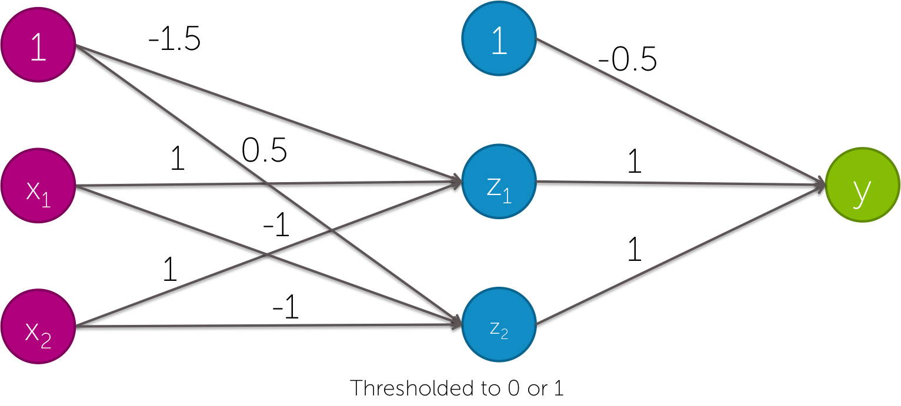

1. Quais das seguintes afirmações são verdadeiras?(Marque todas as opções aplicáveis)

[ ] Os classificadores lineares nunca são úteis, pois não podem representar XOR.
[ ] Os classificadores lineares são úteis porque, com dados suficientes, eles podem representar qualquer coisa.
[x] Ter bons recursos não lineares pode nos permitir aprender classificadores lineares muito precisos. 
[ ] nenhuma das opções acima

1. Um classificador linear simples pode representar qual das seguintes funções?(Marque todas as opções aplicáveis)

[x] x1 OU x2 OU NÃO x3
[x] x1 E x2 E NÃO x3
[x] x1 OU (x2 E NÃO x3)
[ ] nenhuma das opções acima

1. Qual das seguintes redes neurais pode representar a seguinte função? Selecione todas as opções aplicáveis.

1. Qual das seguintes afirmações é verdadeira?(Marque todas as opções aplicáveis)

[X]Os recursos da visão computacional funcionam como detectores locais.
[ ]A aprendizagem profunda teve impacto na visão computacional, pois é usada para combinar todos os diferentes recursos criados manualmente que já existem. 
[X]Ao aprender recursos não lineares, as redes neurais nos permitiram aprender automaticamente detectores para visão computacional. 
[ ]nenhuma das opções acima

1. Se o senhor tiver muitas imagens de diferentes tipos de plâncton rotuladas com o nome da espécie e muitos recursos de computação, o que esperaria que realizasse melhores previsões:

`uma rede neural profunda treinada com esses dados.`

1. Se o senhor tiver algumas imagens de diferentes tipos de plâncton rotuladas com o nome da espécie, o que esperaria que apresentasse melhores previsões:

`um classificador simples treinado nesses dados, usando recursos profundos como entrada, que foram treinados usando dados do ImageNet.`
